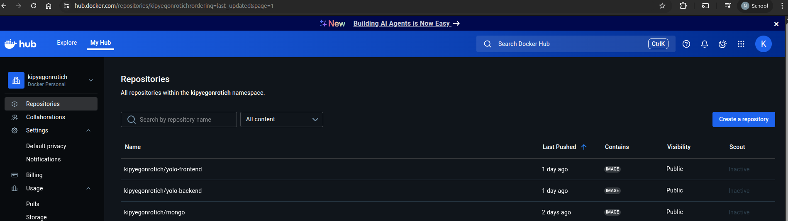

# YOLO E-commerce App IP 4 Orchestration 

This project demonstrates the deployment of the Dockerized YOLO E-commerce application to **Google Kubernetes Engine (GKE)** using Kubernetes manifests. The setup includes:

- MongoDB as a **StatefulSet** with persistent storage
- Frontend and backend services exposed via **LoadBalancers**
- Docker images stored on **Docker Hub**

## Application Components

- **MongoDB** – NoSQL database deployed via StatefulSet
- **Backend** – Express.js API server
- **Frontend** – React.js web UI

## Deployment Architecture

```plaintext
+------------------+        +----------------+        +----------------+
|  Frontend Pod    | <----> |  Backend Pod   | <----> |   MongoDB Pod  |
| (LoadBalancer)   |        | (LoadBalancer) |        | (StatefulSet)  |
+------------------+        +----------------+        +----------------+
```
## Prerequisites

-   Google Cloud SDK
    
-   Docker & Docker Hub account
    
-   GKE Cluster and `kubectl` configured
    


## Folder Structure
yolo-ip4/
│   ├── mongo-statefulset.yaml
│   ├── mongo-service.yaml
│   ├── backend-deployment.yaml
│   ├── backend-service.yaml
│   ├── frontend-deployment.yaml
│   └── frontend-service.yaml
├── README.md
└── explanation.md

## Deployment instructions
### 1: Clone the repo and switch to project directory
git clone https://github.com/kipyegonrotich/yolo-ip4.git
cd yolo-ip4

### 2. Authenticate with GCP and connect to GKE cluster.

### 3: Deploy to GKE
```
kubectl apply -f mongo-statefulset.yaml
kubectl apply -f mongo-service.yaml
kubectl apply -f backend-deployment.yaml
kubectl apply -f backend-service.yaml
kubectl apply -f frontend-deployment.yaml
kubectl apply -f frontend-service.yaml
```

## Access the App
Access the deployed frontend here: 		http://34.29.152.248/
## Docker Images
All components use Docker Hub images from:

-   `kipyegonrotich/yolofrontend`
    
-   `kipyegonrotich/yolobackend`
    
-   `kipyegonrotich/yolomongo`


## Data Persistence
MongoDB is deployed using a **StatefulSet** with a **PersistentVolumeClaim (PVC)** to ensure data is retained across pod restarts or deletions.
