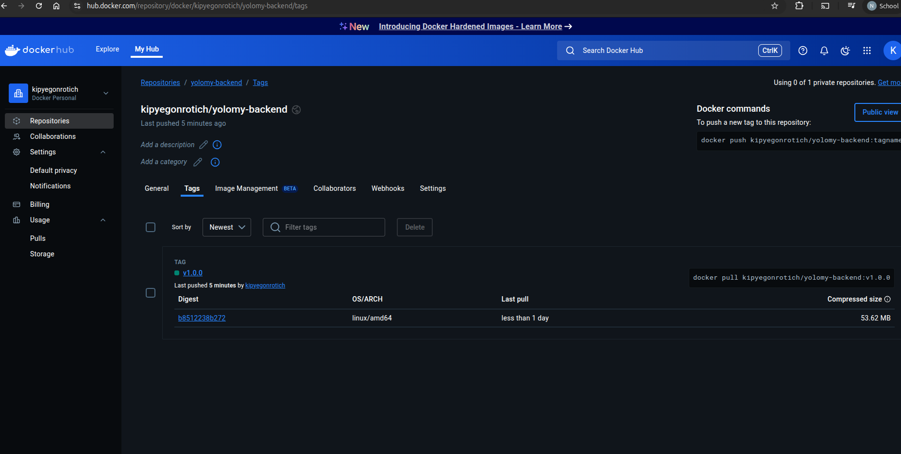

# Explanation of steps undertaken to create a Basic Micro-service

This document explains the reasoning behind my implementation of containerizing the e-commerce platform.

---

## 1. Choice of the Base Images

- **MongoDB**
  - Image: `mongo`
  - I used `mongo` without specifying the tag to default to the latest stable version.

- **Backend**
  - Base Image: Defined in `./backend/Dockerfile` (typically a Node.js alpine variant for smaller image size).
  - `node:alpine` is chosen for the backend to ensure minimal size, faster build times, and security.

- **Frontend**
  - Base Image: Defined in `./client/Dockerfile` (commonly `node:alpine` or `nginx:alpine`).
  - Rationale: Same reason—minimal footprint and fast deployment.
  ---

## 2. Dockerfile Directives

- **Backend**
  - The `Dockerfile` uses:
    - `FROM node:alpine` as the base image.
    - `WORKDIR` to set the working directory.
    - `COPY` to bring the application code.
    - `RUN npm install` to install dependencies.
    - `CMD ["npm", "start"]` to start the server.
    - **Frontend**
  - The `Dockerfile` uses:
    - `FROM node:alpine` for building the frontend app.
    - `WORKDIR` and `COPY` for workspace setup.
    - `RUN npm install && npm run build`.
    ---

## 3. Docker Compose Networking

- **Custom Bridge Network**: `mongo-net`
  - This allows the services to communicate internally via their container names (`mongodb`, `yoloimage`, `yolofrontend`).
- **Ports**
  - MongoDB: `27017`
  - Backend API: `5000`
  - Frontend App: `3000`

 ---

## 4. Docker Compose Volume Definition

- **MongoDB Data Volume**
  - Named volume: `mongo_data`
  - Mounted path: `/data/db`
  - I did this to ensures persistence of product data even after containers are stopped or recreated. 

  ---

## 5. Git Workflow

- **Commits**
  - The repository uses descriptive commits for each step:
    
- **Branches**
  - All changes committed on the `main` branch for this assignment.

- **README**
  - Provides clear setup instructions.

## 6. Successful Running of the Application

- The `docker-compose.yml` file successfully:
  - Builds all images.
  - Launches MongoDB, the backend, and the frontend.
  - Ensures persistence via `mongo_data`.
  - Exposes ports to test the frontend UI and backend API.
  - Application is accessible on:
    - Frontend: `http://localhost:3000`
    - Backend API: `http://localhost:5000`

- **Debugging Measures**
  - Used `docker logs` to confirm services started correctly.
  - Verified MongoDB connection strings.

  ---

## 7. Good Practices

- **Semantic Versioning**
  - Images are tagged with `v1.0.0` 

- **Minimal Base Images**
  - All images based on alpine variants.

---
## Screenshot of Deployed Image on DockerHub
 