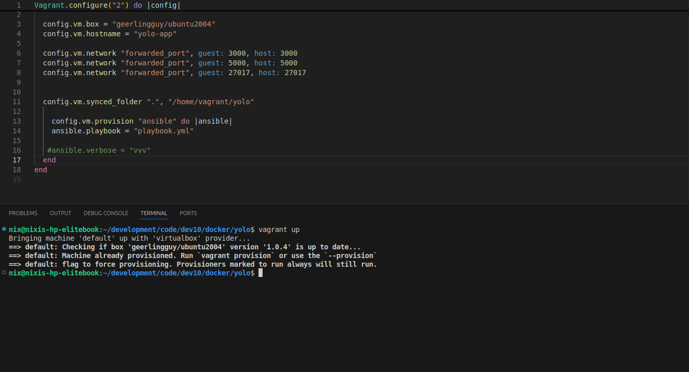
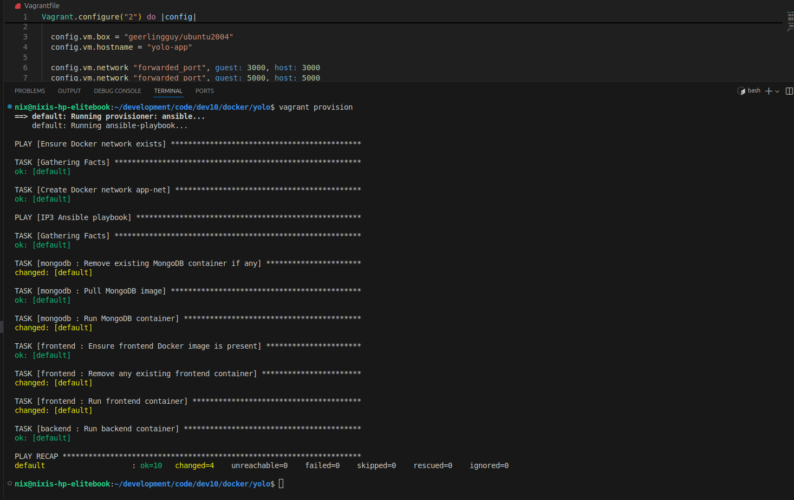

# IP3 App Deployment with Ansible and Vagrant 

This project automates the deployment of a containerized e-commerce dashboard using **Vagrant** and **Ansible**. The app consists of a MongoDB database, a Node.js backend API, and a React frontend.

---

## Stack Summary

- **Vagrant**: Provisions an Ubuntu 20.04 (Jeff Geerlings ubuntu 20.04) virtual machine (VM).
- **Ansible**: Automates container creation and deployment.
- **MongoDB**: Stores the application's data.

---

## Project Structure
```
project-root/
├── Vagrantfile
├── playbook.yml
├── roles/
│ ├── mongodb/
│ │ └── tasks/
│ │ └── main.yml
│ ├── frontend/
│ │ └── tasks/
│ │ └── main.yml
│ └── backend/
│ └── tasks/
│ └── main.yml
├── yolo/
│ ├── backend/ # Node.js backend
│ └── client/ # React frontend
```

---

## Deployment Steps

### 1. Provision the Virtual Machine

Run from the host machine:

```bash
vagrant up 
vagrant provision
```


This will:

    Provision the VM running Ubuntu 20.04

    Install Docker and Ansible

    Prepare the environment for deployment

### 2. Access the Virtual Machine
```bash
vagrant ssh
```

### 3. Execute the Ansible Playbook

Inside the VM:
```bash
ansible-playbook playbook.yml
```

This playbook will:

    Create a Docker network called app-net.

    Deploy the MongoDB container.

    Deploy the backend Node.js API container.

    Deploy the frontend React container.

Access Points
```
Component	Address
Frontend    http://localhost:3000
Backend     http://localhost:5000
MongoDB     localhost:27017 (Docker internal)
```
Docker Containers
```
Name                Image                               Purpose
mongodb_container   mongo                               NoSQL Database
yolo-backend        kipyegonrotich/yolo-backend:v1.0.0  Backend API
yolofrontend        kipyegonrotich/yolo-frontend:v1.0.0 React App UI
```


Common Troubleshooting

View container logs:

```bash
docker logs mongodb_container
```

Rebuild the frontend image:

```bash
cd yolo/client
docker build -t kipyegonrotich/yolo-frontend:v1.0.0 .
``` 

Remove a crashed container:

```bash
docker rm kipyegonrotich/yolo-backend:v1.0.0

```

Remove an image to rebuild fresh:

```bash
docker rmi kipyegonrotich/yolo-backend:v1.0.0

```

Restart all containers:

```bash
docker restart $(docker ps -q)
```

Notes

MongoDB uses Docker volumes for persistent storage, so product data remains intact even after halting or restarting Vagrant.


