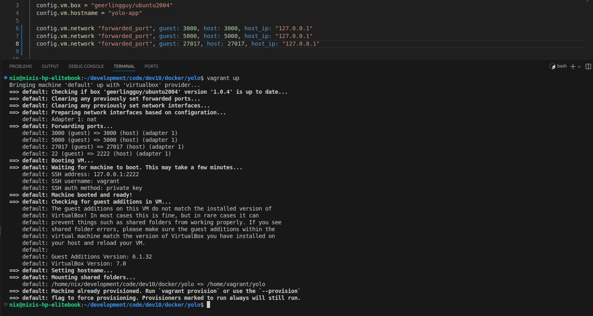
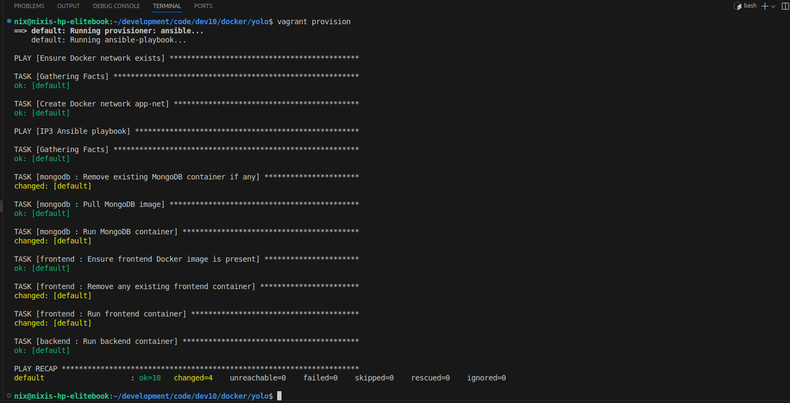
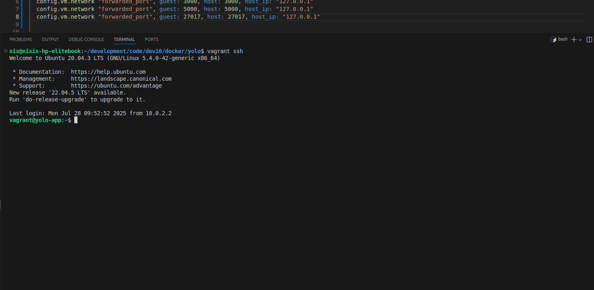
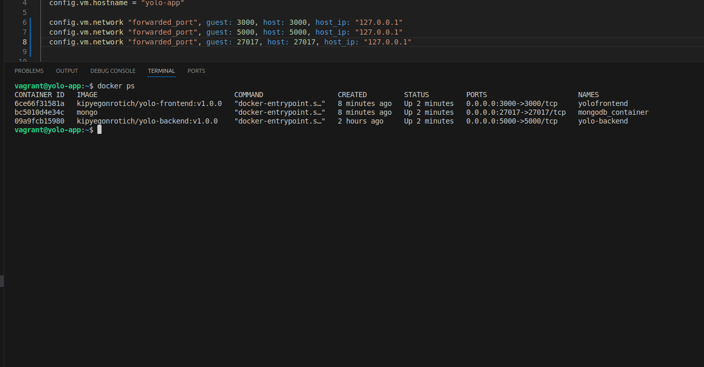
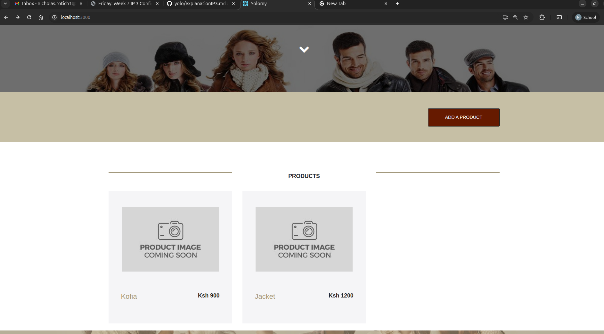
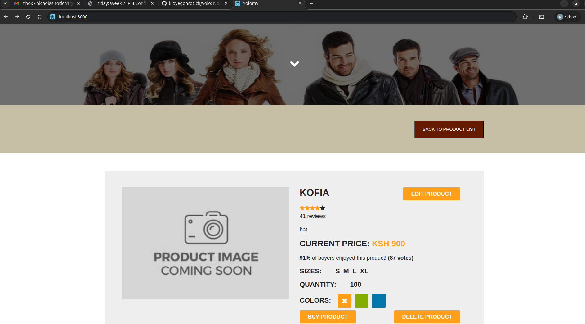

# IP3 Configuration Management - Deployment with Ansible and Vagrant 

This project automates the deployment of a containerized e-commerce dashboard using **Vagrant** and **Ansible**. The app consists of a MongoDB database, a Node.js backend API, and a React frontend.

---

## Stack Summary

- **Vagrant**: Provisions an Ubuntu 20.04 (Jeff Geerlings ubuntu 20.04) virtual machine (VM).
- **Ansible**: Automates container creation and deployment.
- **MongoDB**: Stores the application's data.

---

## Project Structure
```
project-root/
├── Vagrantfile
├── playbook.yml
├── roles/
│ ├── mongodb/
│ │ └── tasks/
│ │ └── main.yml
│ ├── frontend/
│ │ └── tasks/
│ │ └── main.yml
│ └── backend/
│ └── tasks/
│ └── main.yml
├── yolo/
│ ├── backend/ # Node.js backend
│ └── client/ # React frontend
```

---
### Vagrantfile setup
The Vagrantfile defines the VM configuration and triggers Ansible provisioning

### Vagrant Box:

```
     "config.vm.box = "geerlingguy/ubuntu2004"" 
```
Network:
```
    config.vm.network "forwarded_port", guest: 3000, host: 3000, host_ip: "127.0.0.1"
    config.vm.network "forwarded_port", guest: 5000, host: 5000, host_ip: "127.0.0.1"
    config.vm.network "forwarded_port", guest: 27017, host: 27017, host_ip: "127.0.0.1"
```
Maps vagrant VM ports (3000, 5000, 27017) to host ports to enable access

### Ansible Provisioner:
   ```
    config.vm.synced_folder ".", "/home/vagrant/yolo"

    config.vm.provision "ansible" do |ansible|
    ansible.playbook = "playbook.yml"
    
   #ansible.verbose = "vvv"
  end
```
Executes <playbook.yaml> to provision the VM

### Playbook setup
Clone yolo project repository

**This play ensures the target machine is ready by installing Git and cloning the source code for the e-commerce project. It's a setup step before deploying the app (MongoDB, frontend, backend).**

Ensure Docker Network Exists
```
- name: Ensure Docker network exists
  hosts: all
  become: true
  tasks:
    - name: Create Docker network app-net
      community.docker.docker_network:
        name: app-net
        state: present
```
- Target all hosts (<hosts: all>)

- Use <become: true> → Run commands as root

- Create a Docker network named <app-net> using the <community.docker.docker_network> module

    If it doesn’t exist, Ansible creates it

    If it already exists, Ansible does nothing
        
Run Role-Based Deployments

```
    - name: IP3 Ansible playbook
  hosts: all
  become: true
  roles: 
    - mongodb
    - frontend
    - backend
```
- Target all hosts again

- Use <become: true> for root access

- Apply the following Ansible roles in order:

    mongodb: deploys MongoDB container

    frontend: deploys the frontend container (React)

    backend: deploys the backend container (Node.js)

### Result
- A Docker network <app-net> is created for communication between containers

- MongoDB, backend, and frontend services are each deployed in their own containers

- All containers are attached to <app-net>, enabling them to talk to each other

## Deployment process 

### 1. Provision the Virtual Machine

Run from the host machine:

```bash
vagrant up 
vagrant provision
```


This will:

    Provision the VM running Ubuntu 20.04

    Install Docker and Ansible

    Prepare the environment for deployment

### 2. Access the Virtual Machine
```bash
vagrant ssh
```


### 3. Execute the Ansible Playbook

Inside the VM:
```bash
ansible-playbook playbook.yml
```

This playbook will:

    Create a Docker network called app-net.

    Deploy the MongoDB container.

    Deploy the backend Node.js API container.

    Deploy the frontend React container.

Access Points
```
Component	Address
Frontend    http://localhost:3000
Backend     http://localhost:5000
MongoDB     localhost:27017 (Docker internal)
```
Docker Containers
```
Name                Image                               Purpose
mongodb_container   mongo                               NoSQL Database
yolo-backend        kipyegonrotich/yolo-backend:v1.0.0  Backend API
yolofrontend        kipyegonrotich/yolo-frontend:v1.0.0 React App UI
```


### Git Workflow
Commits
Descriptive commits for each step to be able to track progress clearly: examples below shows some descriptive commits
```
git commit -m "deleted original files that existed to allow me create mine"
git commit -m "Created new vagrantfile"
git commit -m "define the roles that will be provisioned"
git commit -m "create tasks under roles for each container and database"
git commit -m "add tasks to the playbook to be executed under roles"
git commit -m "create a task to provision MongoDB database container"
git commit -m "define ansible role that spins up the MongoDB container"
git commit -m "define ansible role that spins up the frontend and backend containers"
git commit -m "add persistency to ensure that the uploaded products are not lost when restarted"
git commit -m "Add screenshot of results from various stages"

```

### Common Troubleshooting

View container logs:

```bash
docker logs mongodb_container
```

Rebuild the frontend image:

```bash
cd yolo/client
docker build -t kipyegonrotich/yolo-frontend:v1.0.0 .
``` 

Remove a crashed container:

```bash
docker rm kipyegonrotich/yolo-backend:v1.0.0

```

Remove an image to rebuild fresh:

```bash
docker rmi kipyegonrotich/yolo-backend:v1.0.0

```

Restart all containers:

```bash
docker restart $(docker ps -q)
```

### Notes

MongoDB uses Docker volumes for persistent storage, so product data remains intact even after halting or restarting Vagrant.

This is defined in roles/task/main.yml




