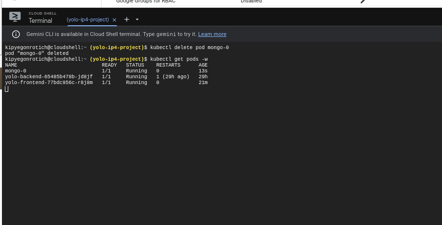

# Technical Explanation: GKE Kubernetes Deployment of YOLO App

This document explains the key design choices made in deploying the YOLO e-commerce app on Google Kubernetes Engine.

## Objective

The objective was to deploy a multi-container, Dockerized e-commerce web application to **Google Kubernetes Engine (GKE)** using best practices in Kubernetes ensuring
- Scalability
- Resilience
- Data persistence
---

## Application Components

**Frontend**: Serves the user interface.

- **Kind:** Deployment
- **Service:** LoadBalancer
- **Image:** kipyegonrotich/yolofrontend
- **Port:** 3000 Communicates with backend via its LoadBalancer IP

**Backend**: Handles business logic and connects to the database
- **Kind:** Deployment
- **Service:** LoadBalancer
- **Image:** kipyegonrotich/yolobackend
- **Port:** 5000 Connects to MongoDB using internal service DNS

**MongoDB**: Stores user/product data persistently.
- **Kind:** StatefulSet
- **Storage:** PersistentVolumeClaim (ReadWriteOnce)
- **Image:** kipyegonrotich/yolomongo

**Why StatefulSet?**
  - Guarantees stable DNS: mongo-0.mongo.default.svc.cluster.local
  - Ensures ordered pod creation and persistence of volume
---

## Architecture

### 1. **MongoDB**

- **StatefulSet with PersistentVolumeClaim (PVC)** used instead of Deployment to manage pod identity,  stable storage and  ensures MongoDB data is retained across pod restarts or node failures or deletion.
- **ClusterIP Service** exposes MongoDB internally.

### 2. **Backend**

- Deployed via Deployment with a LoadBalancer service for external access.
- Connects to MongoDB via internal DNS (mongo-0.mongo:27017).
- Container image from Docker Hub: kipyegonrotich/yolo-backend:v1.0.2.

### 3. **Frontend**

- Also deployed via Deployment.
- LoadBalancer service exposes it publicly.
- Container image: kipyegonrotich/yolo-frontend:v1.0.5.

---

## Networking

- Frontend and backend are exposed to the internet via LoadBalancer services.
- MongoDB is only accessible within the cluster via ClusterIP.

---

## Notes

- All manifests were applied using kubectl apply -f <filename>.
- Health checks and container ports were aligned to the Dockerfiles.
- MongoDB is configured to run as a single replica due to simplicity.
- All Docker images are hosted on Docker Hub under the user: kipyegonrotich.

---
## Persistence Test
To ensure that data added to the cart (stored in MongoDB) is **not lost when the pod is deleted**, I configured persistent storage using the following:

- **PersistentVolumeClaim** with appropriate storageClass and access modes.
- **VolumeMount** in the StatefulSet definition for MongoDB.

This setup ensures that MongoDB writes data to a persistent disk that remains intact even after pod termination or rescheduling.

- A product was added via the frontend UI.
- The Mongo pod (mongo-0) was deleted using:
  

bash
  kubectl delete pod mongo-0 -n yolo-app

- The pod restarted automatically and the product data persisted — confirming the PersistentVolume was working.

## Outcome

- The application is accessible at [http://34.29.152.248](http://34.29.152.248)

